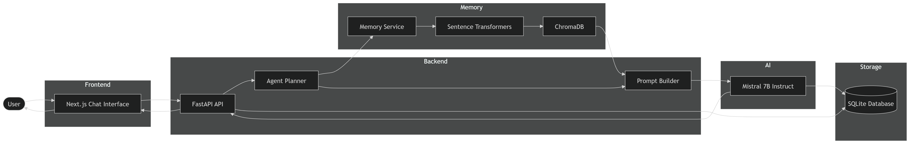
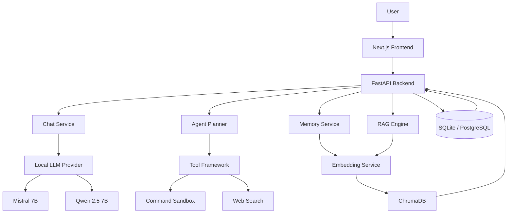

# Aegis AI

Aegis AI is a local-first, privacy-focused AI assistant platform built with a modern full-stack architecture. It combines a Next.js frontend, FastAPI backend, local Large Language Models (LLMs), Retrieval-Augmented Generation (RAG), long-term memory, agent planning, and tool execution into a unified AI ecosystem.

The platform is designed to run entirely on local or self-hosted infrastructure, giving developers complete control over their models, data, and workflows.



---

## Features

### AI Chat System

- Real-time streaming AI responses
- Persistent conversation history
- Multi-session chat management
- Local LLM execution
- Support for Mistral 7B and Qwen 2.5 7B

### Retrieval-Augmented Generation (RAG)

- Document ingestion pipeline
- Automatic text chunking
- Embedding generation
- ChromaDB vector storage
- Semantic document retrieval

### Long-Term Memory

- Conversation summarization
- Embedding-based memory storage
- Context retrieval across sessions
- Personalized responses

### Agent Framework

- Planning and reasoning engine
- Multi-step task execution
- Tool orchestration
- Extensible agent architecture

### Tool System

- Web search abstraction
- Command execution sandbox
- Custom tool integration
- Safe execution environment

### Persistence Layer

- SQLite support for local development
- PostgreSQL support for production
- SQLAlchemy ORM
- Alembic database migrations

### Deployment Ready

- Docker support
- Cloud deployment compatible
- Lightning AI compatible
- Self-hosted infrastructure support

---

# System Architecture

```text
Frontend (Next.js)
        │
        ▼
FastAPI REST API
        │
 ┌──────┼──────┐
 ▼      ▼      ▼
Chat   Agent  Memory
 │      │      │
 ▼      ▼      ▼
LLM   Tools   RAG
 │             │
 ▼             ▼
Transformers  ChromaDB
        │
        ▼
 Local Mistral / Qwen
```

---

## Architecture Diagram



---

# Technology Stack

## Frontend

- Next.js 15
- React 19
- TypeScript
- Tailwind CSS
- Streaming UI

## Backend

- FastAPI
- Python 3.12
- Async SQLAlchemy
- Pydantic v2
- Alembic

## AI Layer

- Hugging Face Transformers
- PyTorch
- Mistral 7B Instruct
- Qwen 2.5 7B Instruct
- Sentence Transformers

## Vector Database

- ChromaDB

## Storage

- SQLite
- PostgreSQL

## Deployment

- Docker
- Docker Compose
- Lightning AI
- Cloudflare Tunnel

---

# Project Structure

```text
LLM/
│
├── apps/
│   ├── api/
│   │   ├── app/
│   │   │   ├── api/
│   │   │   ├── core/
│   │   │   ├── models/
│   │   │   ├── services/
│   │   │   │   ├── ai/
│   │   │   │   ├── rag/
│   │   │   │   ├── memory/
│   │   │   │   ├── agents/
│   │   │   │   └── tools/
│   │   │   └── db/
│   │   └── tests/
│   │
│   └── web/
│       ├── app/
│       ├── components/
│       ├── hooks/
│       ├── lib/
│       └── public/
│
├── docs/
├── docker/
├── scripts/
└── README.md
```

---

# Quick Start

## Clone Repository

```bash
git clone https://github.com/karthiktatineni/LLM.git
cd LLM
```

## Install Dependencies

```bash
npm install
```

## Backend Setup

```bash
cd apps/api

python -m venv .venv

source .venv/bin/activate
# Windows:
# .venv\Scripts\activate

pip install -U pip

pip install -e ".[dev]"
```

## Environment Configuration

Create a `.env` file in the project root.

```env
AEGIS_ENV=development

LLM_PROVIDER=transformers

LOCAL_MODEL_ID=mistralai/Mistral-7B-Instruct-v0.3

LOCAL_EMBEDDING_MODEL=sentence-transformers/all-MiniLM-L6-v2

MODEL_DEVICE=auto

MODEL_DTYPE=auto
```

---

# Running the Application

## Start Backend

```bash
npm run dev:api
```

Backend:

```text
http://localhost:8000
```

API Docs:

```text
http://localhost:8000/api/v1/docs
```

## Start Frontend

```bash
npm run dev:web
```

Frontend:

```text
http://localhost:3000
```

---

# Local Models

Supported models:

- Mistral-7B-Instruct-v0.3
- Qwen2.5-7B-Instruct

Example:

```env
LLM_PROVIDER=transformers

LOCAL_MODEL_ID=mistralai/Mistral-7B-Instruct-v0.3
```

For low-memory GPUs, use quantized GGUF or 4-bit variants.

---

# Docker Deployment

```bash
docker compose up --build
```

Services:

- Frontend
- Backend
- PostgreSQL
- ChromaDB Storage

---

# Development Roadmap

- [x] Streaming Chat
- [x] Conversation History
- [x] Local LLM Support
- [x] ChromaDB Integration
- [x] Agent Framework
- [x] Long-Term Memory
- [x] Docker Deployment
- [ ] Multi-Agent Collaboration
- [ ] Voice Interface
- [ ] Vision Models
- [ ] MCP Tool Integration

---

# License

Licensed under the MIT License.

---

# Author

**Karthik Tatineni**

GitHub: https://github.com/karthiktatineni