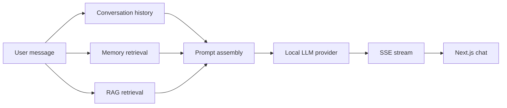
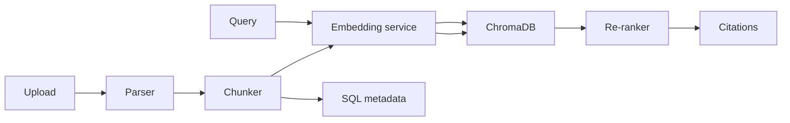

# Architecture

Aegis AI is split into two deployable apps.

## Frontend

The Next.js app is a SaaS-style workspace with chat, knowledge, and settings surfaces. The chat client consumes server-sent events, renders Markdown with code highlighting, and updates messages optimistically.

## Backend

FastAPI exposes versioned REST endpoints under `/api/v1`. The service layer owns model calls, memory retrieval, RAG ingestion, agent planning, and tool execution. Repositories isolate SQLAlchemy access from route handlers.

## AI Flow

## RAG Flow

